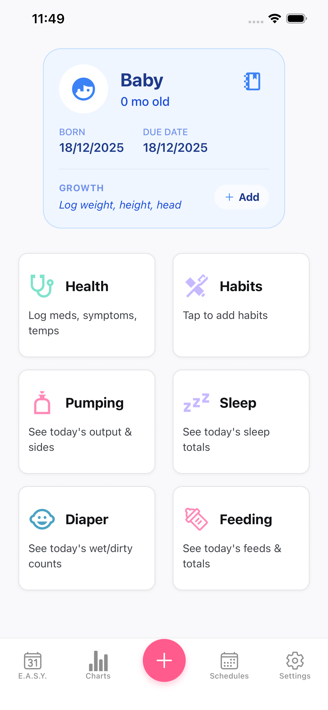
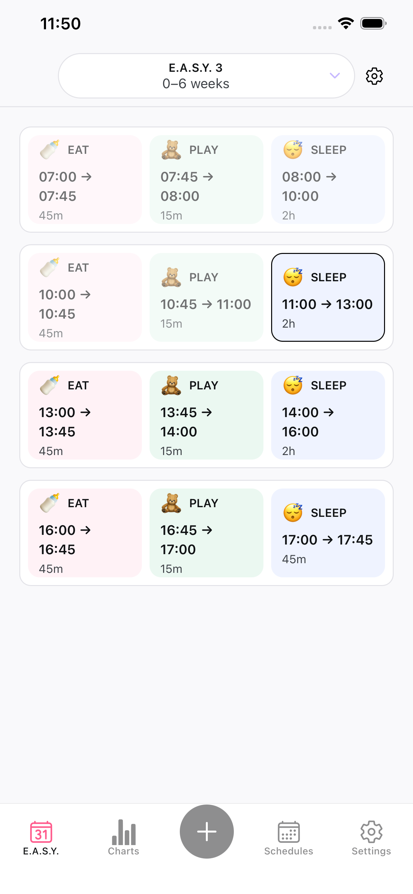
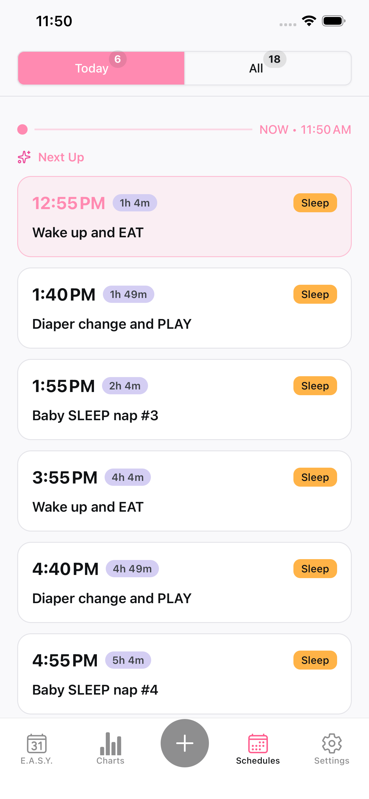

# Easy Baby Tracker 👶

**The simple, privacy-first baby tracking app that works offline.**

Track every precious moment of your baby's journey with our lightweight, easy-to-use app. Monitor feeding, sleep, diapers, growth, and health - all stored securely on your device.

## ✨ Key Features

### 🍼 Comprehensive Tracking

- **Feeding Tracker**: Log breastfeeding, bottle feeding, and pumping sessions with timers
- **Sleep Monitor**: Track sleep patterns, naps, and bedtime routines
- **Diaper Log**: Record wet and dirty diapers to monitor your baby's health
- **Growth Charts**: Track weight, height, and head circumference with beautiful visualizations
- **Health Records**: Log medications, temperatures, and doctor visits

### 📊 Insights & Analytics

- Visual charts and graphs to identify patterns
- Daily, weekly, and monthly summaries
- Trend analysis for feeding and sleep schedules
- Timeline view of your baby's entire day

### ⏰ E.A.S.Y. Method Support

- Built-in E.A.S.Y. scheduling (Eat, Activity, Sleep, You time)
- Age-appropriate routine recommendations
- Customizable schedules for your baby's needs
- Notifications to help you stay on track

### 🔒 Privacy-Focused Design

- **100% offline** - no internet required
- All data stored securely on your device only
- No cloud sync, no data sharing
- Your baby's information stays completely private
- No ads, no tracking, no third-party analytics

### ✨ Designed for Parents

- Clean, intuitive interface
- Quick entry for busy parents
- Dark mode support for nighttime feeding
- Multiple baby profiles
- One-handed operation - perfect for when you're holding your baby

## 📱 Download

- **iOS**: [Download on the App Store](https://apps.apple.com/us/app/easy-baby-tracker/id6755802501)
- **Android**: [Get it on Google Play](https://play.google.com/store/apps/details?id=com.hunght.BabyEase)

## 🎯 Perfect For

- First-time parents navigating newborn care
- Experienced parents managing multiple children
- Caregivers and grandparents helping with baby care
- Parents sharing care responsibilities
- Anyone tracking baby's routine for pediatrician visits

## 🌟 Why Choose Easy Baby Tracker?

Unlike other baby apps that require internet, subscriptions, or share your data, Easy Baby Tracker respects your privacy. Everything stays on your device, works offline, and puts you in complete control of your baby's information.

Whether you're tracking your newborn's first weeks or monitoring your toddler's development, Easy Baby Tracker grows with your family.

## 📸 Screenshots

### Main Tracking Interface

### Quick Activity Logging

### E.A.S.Y. Schedule View

### Scheduling & Routines

### Sleep Tracking

### Settings & Customization

## 🤝 Connect With Us

- **Website**: [easybabytracker.com](https://easybabytracker.com)
- **Twitter**: [@hugboringdev](https://x.com/hugboringdev)
- **GitHub**: [View Source Code](https://github.com/hunght/easy-baby-tracker)

## 📄 License

This project is open source and available for the community to use and contribute to.

---

**Note**: Easy Baby Tracker is designed to complement, not replace, professional medical advice. Always consult your pediatrician for health concerns.
